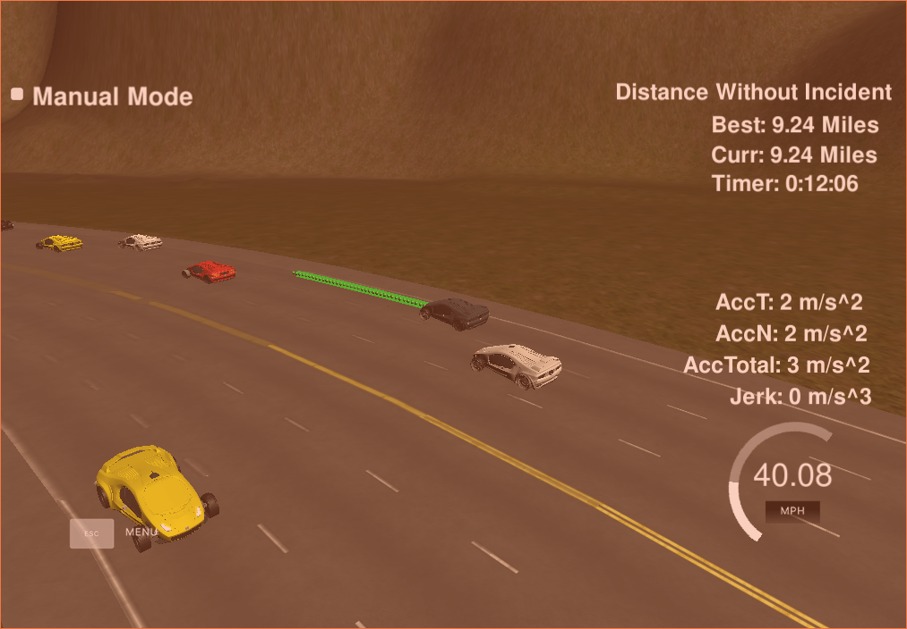

# Udacity Term 3 Path Planning project
# [Rubic](https://review.udacity.com/#!/rubrics/1020/view) points

## Valid trajectories

### The car is able to drive at least 4.32 miles without incident.
I ran the simulator for 15 and 20 miles without incidents:

### The car drives according to the speed limit.
No speed limit red message was seen.

### Max Acceleration and Jerk are not Exceeded.
Max jerk red message was not seen.

### Car does not have collisions.
No collisions.

### The car stays in its lane, except for the time between changing lanes.
The car stays in its lane most of the time but when it changes lane because of traffic or to return to the center lane.

### The car is able to change lanes
The car change lanes when the there is a slow car in front of it, and it is safe to change lanes (no other cars around) or when it is safe to return the center lane.

## Reflection

### Prediction [main.cpp line 268 to line 291]
This part of the code decides whether there is a car in the ego car's lane, a car in its dangerous zone(+/- 30m) in the right or left lane.

### Behavior [main.cpp line 294 to line 308]
This part decides what to do:
  - If we have a car in front of us, we change lane
  - Flag if we have to slow down

Based on the prediction of the situation we are in, this code flags to increases the speed, decrease speed, or make a lane change when it is safe.

### Accelerating / Decelerating [main.cpp line 311 to 327]
This part of the code makes smooth accelerations and decelerations.
And in case of decelerating due to a blocking car, the ego car maintain the blocking car's speed for comfort.

### Trajectory [main.cpp line 328 to line 428]
This code does the calculation of the trajectory based on the speed and lane output from the behavior, car coordinates and past path points.

First, the last two points of the previous trajectory (or the car position if there are no previous trajectory, lines 336 to 362) are used in conjunction three points at a far distance (lines 365 to 375) to initialize the spline calculation (line 387 and 391). To make the work less complicated to the spline calculation based on those points, the coordinates are transformed (shift and rotation) to local car coordinates (lines 377 to 385).

In order to ensure more continuity on the trajectory (in addition to adding the last two point of the past trajectory to the spline adjustment), the past trajectory points are copied to the new trajectory (lines 395 to 399). The rest of the points are calculated by evaluating the spline and transforming the output coordinates to global coordinates (lines 419 to 424). The speed change is decided on the behavior part of the code, but it is used in that part (line 410) to increase/decrease speed on every trajectory points instead of doing it for the complete trajectory.
